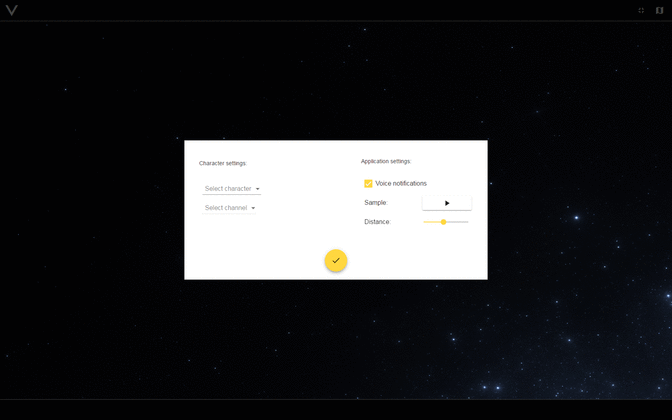

# VISIT for EVE Online
>Yet another [EVE Online](https://www.eveonline.com/) **Vis**ual **I**ntel **T**ool

    

Cross-platform app which analyses and visualizes data from the selected intel in-game channel. Track pilot's position and send notifications of threat using synthesis speech.

## Screenshots

    

## Installation

The application is based on [electron](https://electron.atom.io/), which in turn uses [Chromium](https://www.chromium.org/Home), in order to be used on any operating system. Installation packages are available on the [release](https://github.com/gemoroy/visit/releases/latest) page.

### Installation notes

Being installed on Windows, the application is located in the directory `%USERPROFILE%\AppData\Local\visit`
In order to find the directory, you need to use an `Explorer`. You need to indicate `%LOCALAPPDATA%\visit` in the address line. Use `F4` to focus on the address line.

## Questions and Suggestions

You can report a problem or ask questions either with the help of github on [Issues](https://github.com/gemoroy/visit/issues/new) page or EVE-mail [Lucien La'bar](https://gate.eveonline.com/Profile/Lucien%20La'bar)

## TODO

- [SSO](http://eveonline-third-party-documentation.readthedocs.io/en/latest/sso/index.html) authorization and receiving the location based on [ESI](https://esi.tech.ccp.is/latest/).

- Implementation of ‘radar’ mode in the form of a floating window

