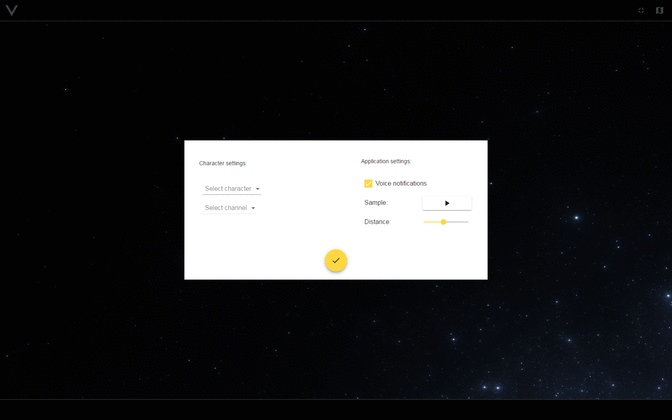

# VISIT для EVE Online
>Очередное приложение для [EVE Online](https://www.eveonline.com/) анализирующее intel-чат.

    

Кроссплатформенное приложение которое анализирует и визуализирует содержимое выбранного пользователем intel-канала. Отслеживает местоположение пилота и, при соответствующей настройке, оповещает пилота о приближении опасности с помощью синтезированной речи.

## Скриншоты

    

## Установка

Приложение построено на основе [electron](https://electron.atom.io/), который в свою очередь использует [Chromium](https://www.chromium.org/Home), в связи с чем использоваться может на любой из операционных систем. Инсталяционные пакеты доступны на старнице с [релизами](https://github.com/gemoroy/visit/releases/latest) 

### Особенности установки

#### Windows
При установке на одной из операционных систем **Windows**, приложение будет размещено в директории `%USERPROFILE%\AppData\Local\visit`. Для обнаружения директории достаточночно воспользоваться `Проводником`. В адресной строке проводника необходимо указать `%LOCALAPPDATA%\visit`. Перевести фокус на адресную строку проводника можно с помощью нажатия клавиши `F4`.

### Вопросы и предложения

Сообщить о проблеме или задать вопрос вы можете как с помощью github, на странице [issues](https://github.com/gemoroy/visit/issues/new), так и письмом на [Lucien La'bar](https://gate.eveonline.com/Profile/Lucien%20La'bar)

### Что дальше

 - [SSO](http://eveonline-third-party-documentation.readthedocs.io/en/latest/sso/index.html) авторизация и получение мастоположения на основании [ESI](https://esi.tech.ccp.is/latest/).
 - Реализация режима радара, в виде небольшого плавающего окна.